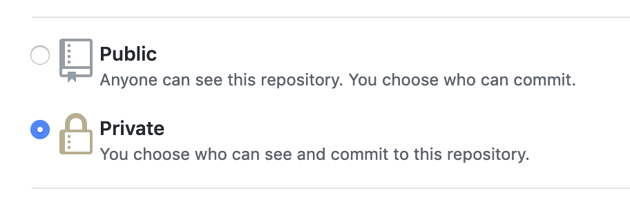

# cc-pks-builder

## Create your jumpbox from your local machine or Google Cloud Shell

```bash
GCP_PROJECT_ID=<TARGET_GCP_PROJECT_ID>
gcloud auth login --project ${GCP_PROJECT_ID} --quiet

gcloud services enable compute.googleapis.com \
  --project "${GCP_PROJECT_ID}"

gcloud compute instances create "jbox-pal" \
  --image-project "ubuntu-os-cloud" \
  --image-family "ubuntu-1804-lts" \
  --boot-disk-size "200" \
  --machine-type=g1-small \
  --project "${GCP_PROJECT_ID}" \
  --zone "us-central1-a"
```

## Move to the jumpbox and log in to GCP

```bash
gcloud compute ssh ubuntu@jbox-pal \
  --project "${GCP_PROJECT_ID}" \
  --zone "us-central1-a"
```
  
```bash
gcloud auth login --quiet
```

All following commands should be executed from the jumpbox unless otherwsie instructed.

## Prepare your environment file

```bash
echo "# *** your environment-specific variables will go here ***" > ~/.env
echo "PIVNET_UAA_REFRESH_TOKEN=CHANGE_ME_PIVNET_UAA_REFRESH_TOKEN" >> ~/.env # e.g. xxxxxxxxxxxxxxxxxxxxxxxxxxxxxxxx-r
echo "PKS_DOMAIN_NAME=CHANGE_ME_DOMAIN_NAME" >> ~/.env                       # e.g. pal.pivotal.io
echo "PKS_SUBDOMAIN_NAME=CHANGE_ME_SUBDOMAIN_NAME" >> ~/.env                 # e.g. maroon
echo "AWS_ACCESS_KEY_ID=CHANGE_ME_AWS_ACCESS_KEY_ID" >> ~/.env               # e.g. ~20 chars
echo "AWS_SECRET_ACCESS_KEY=CHANGE_ME_AWS_SECRET_ACCESS_KEY" >> ~/.env       # e.g. ~40 chars

echo "export OM_TARGET=https://pcf.\${PKS_SUBDOMAIN_NAME}.\${PKS_DOMAIN_NAME}" >> ~/.env
echo "export OM_USERNAME=admin" >> ~/.env
echo "export OM_PASSWORD=$(uuidgen)" >> ~/.env
echo "export OM_DECRYPTION_PASSPHRASE=\${OM_PASSWORD}" >> ~/.env
echo "export OM_SKIP_SSL_VALIDATION=true" >> ~/.env
```

__Before__ continuing, open the `.env` file and update the `CHANGE_ME` values accordingly.

Ensure these variables get set into the shell every time the ubuntu user connects to the jumpbox:

```bash
echo "source ~/.env" >> ~/.bashrc
```

Load the variables into your shell with the source command so we can use them immediately:

```bash
source ~/.env
```

## Prepare jumpbox and generate service account

```bash
gcloud services enable iam.googleapis.com --async
gcloud services enable cloudresourcemanager.googleapis.com --async
gcloud services enable dns.googleapis.com --async
gcloud services enable sqladmin.googleapis.com --async

sudo apt update --yes && \
sudo apt install --yes jq && \
sudo apt install --yes build-essential && \
sudo apt install --yes ruby-dev && \
sudo apt install --yes awscli && \
sudo apt install --yes tree
```

```bash
cd ~

FLY_VERSION=5.0.0
wget -O fly.tgz https://github.com/concourse/concourse/releases/download/v${FLY_VERSION}/fly-${FLY_VERSION}-linux-amd64.tgz && \
  tar -xvf fly.tgz && \
  sudo mv fly /usr/local/bin && \
  rm fly.tgz
  
CT_VERSION=0.3.0
wget -O control-tower https://github.com/EngineerBetter/control-tower/releases/download/${CT_VERSION}/control-tower-linux-amd64 && \
  chmod +x control-tower && \
  sudo mv control-tower /usr/local/bin/

OM_VERSION=0.51.0
wget -O om https://github.com/pivotal-cf/om/releases/download/${OM_VERSION}/om-linux && \
  chmod +x om && \
  sudo mv om /usr/local/bin/

PN_VERSION=0.0.55
wget -O pivnet https://github.com/pivotal-cf/pivnet-cli/releases/download/v${PN_VERSION}/pivnet-linux-amd64-${PN_VERSION} && \
  chmod +x pivnet && \
  sudo mv pivnet /usr/local/bin/

BOSH_VERSION=5.4.0
wget -O bosh https://s3.amazonaws.com/bosh-cli-artifacts/bosh-cli-${BOSH_VERSION}-linux-amd64 && \
  chmod +x bosh && \
  sudo mv bosh /usr/local/bin/
  
CHUB_VERSION=2.2.1
wget -O credhub.tgz https://github.com/cloudfoundry-incubator/credhub-cli/releases/download/${CHUB_VERSION}/credhub-linux-${CHUB_VERSION}.tgz && \
  tar -xvf credhub.tgz && \
  sudo mv credhub /usr/local/bin && \
  rm credhub.tgz

TF_VERSION=0.11.13
wget -O terraform.zip https://releases.hashicorp.com/terraform/${TF_VERSION}/terraform_${TF_VERSION}_linux_amd64.zip && \
  unzip terraform.zip && \
  sudo mv terraform /usr/local/bin && \
  rm terraform.zip
  
TGCP_VERSION=0.74.0
wget -O terraforming-gcp.tar.gz https://github.com/pivotal-cf/terraforming-gcp/releases/download/v${TGCP_VERSION}/terraforming-gcp-v${TGCP_VERSION}.tar.gz && \
  tar -zxvf terraforming-gcp.tar.gz && \
  rm terraforming-gcp.tar.gz
```

```bash
gcloud iam service-accounts create p-service --display-name "Pivotal Service Account"

gcloud projects add-iam-policy-binding $(gcloud config get-value core/project) \
  --member "serviceAccount:p-service@$(gcloud config get-value core/project).iam.gserviceaccount.com" \
  --role 'roles/owner'

cd ~
gcloud iam service-accounts keys create 'gcp_credentials.json' \
  --iam-account "p-service@$(gcloud config get-value core/project).iam.gserviceaccount.com"
```

## Create a self-signed certificate for PKS

```bash
mkdir -p ~/certs
cd ~/certs

DOMAIN=${PKS_SUBDOMAIN_NAME}.${PKS_DOMAIN_NAME}
KEY_BITS=2048
DAYS=365

openssl req -new -x509 -nodes -sha256 -newkey rsa:${KEY_BITS} -days ${DAYS} \
  -keyout ${DOMAIN}.ca.key.pkcs8 \
  -out ${DOMAIN}.ca.crt \
  -config <( cat << EOF
[ req ]
prompt = no
distinguished_name    = dn
[ dn ]
C  = US
O = Pivotal
CN = Toolsmiths autogenerated CA
EOF
)

openssl rsa \
  -in ${DOMAIN}.ca.key.pkcs8 \
  -out ${DOMAIN}.ca.key

openssl req -nodes -sha256 -newkey rsa:${KEY_BITS} -days ${DAYS} \
  -keyout ${DOMAIN}.key \
  -out ${DOMAIN}.csr \
  -config <( cat << EOF
[ req ]
prompt = no
distinguished_name = dn
req_extensions = v3_req
[ dn ]
C  = US
O = Pivotal
CN = *.${DOMAIN}
[ v3_req ]
subjectAltName = DNS:*.${DOMAIN}, DNS:*.apps.${DOMAIN}, DNS:*.sys.${DOMAIN}, DNS:*.login.sys.${DOMAIN}, DNS:*.uaa.sys.${DOMAIN}, DNS:*.pks.${DOMAIN}
EOF
)

openssl x509 -req -sha256 -days ${DAYS} \
  -in ${DOMAIN}.csr \
  -CA ${DOMAIN}.ca.crt -CAkey ${DOMAIN}.ca.key.pkcs8 -CAcreateserial \
  -out ${DOMAIN}.host.crt \
  -extfile <( cat << EOF
basicConstraints = CA:FALSE
subjectAltName = DNS:*.${DOMAIN}, DNS:*.apps.${DOMAIN}, DNS:*.sys.${DOMAIN}, DNS:*.login.sys.${DOMAIN}, DNS:*.uaa.sys.${DOMAIN}, DNS:*.pks.${DOMAIN}
subjectKeyIdentifier = hash
EOF
)

cat ${DOMAIN}.host.crt ${DOMAIN}.ca.crt > ${DOMAIN}.crt
```

## Terraform the infrastructure

```bash
cd ~/terraforming/terraforming-pks

cat > terraform.tfvars <<-EOF
dns_suffix          = "${PKS_DOMAIN_NAME}"
env_name            = "${PKS_SUBDOMAIN_NAME}"
region              = "us-central1"
zones               = ["us-central1-b", "us-central1-a", "us-central1-c"]
project             = "$(gcloud config get-value core/project)"
opsman_image_url    = ""
opsman_vm           = 0
create_gcs_buckets  = "false"
external_database   = 0
isolation_segment   = "false"
service_account_key = <<SERVICE_ACCOUNT_KEY
$(cat ~/gcp_credentials.json)
SERVICE_ACCOUNT_KEY
EOF

terraform init
terraform apply --auto-approve
```

Note the `opsman_image_url != ""` and `opsman_vm = 0` settings which prohibit Terraform from downloading and deploying the Ops Manager VM.
The Concourse pipelines will take responsibility for this.

This will take about 5-10 mins to complete.

## Install Concourse

```bash
GOOGLE_APPLICATION_CREDENTIALS=~/gcp_credentials.json \
  control-tower deploy \
    --region us-central1 \
    --iaas gcp \
    --workers 3 \
    ${PKS_SUBDOMAIN_NAME}
```

This will take about 20 mins to complete.

## Verify BOSH and Credhub connectivity

```bash
eval "$(GOOGLE_APPLICATION_CREDENTIALS=~/gcp_credentials.json \
  control-tower info \
    --region us-central1 \
    --iaas gcp \
    --env ${PKS_SUBDOMAIN_NAME})"

bosh env
credhub --version
```

## Persist a few credentials

```bash
INFO=$(GOOGLE_APPLICATION_CREDENTIALS=~/gcp_credentials.json \
  control-tower info \
    --region us-central1 \
    --iaas gcp \
    --json \
    ${PKS_SUBDOMAIN_NAME}
)
echo "CC_ADMIN_PASSWD=$(echo ${INFO} | jq --raw-output .config.concourse_password)" >> ~/.env
echo "CREDHUB_CA_CERT='$(echo ${INFO} | jq --raw-output .config.credhub_ca_cert)'" >> ~/.env
echo "CREDHUB_CLIENT=credhub_admin" >> ~/.env
echo "CREDHUB_SECRET=$(echo ${INFO} | jq --raw-output .config.credhub_admin_client_secret)" >> ~/.env
echo "CREDHUB_SERVER=$(echo ${INFO} | jq --raw-output .config.credhub_url)" >> ~/.env
source ~/.env
```

## Check Concourse targets and check the pre-configured pipeline:

```bash
fly targets
fly -t control-tower-${PKS_SUBDOMAIN_NAME} pipelines
```

Navigate to the `url` shown for `fly targets`.

Use `admin` user and the value of `CC_ADMIN_PASSWD` to login and see the pre-configured pipeline.

__Note__ `control-tower` will log you in but valid access tokens will expire every 24 hours. The command to log back in is:

```bash
fly -t control-tower-${PKS_SUBDOMAIN_NAME} login --insecure --username admin --password ${CC_ADMIN_PASSWD}
```

## Set up dedicated GCS bucket for downloads

```bash
gsutil mb -c regional -l us-central1 gs://${PKS_SUBDOMAIN_NAME}-concourse-resources
gsutil versioning set on gs://${PKS_SUBDOMAIN_NAME}-concourse-resources
```

## Create and register a GitHub SSH key for the jumpbox

Follow [these instructions](https://help.github.com/en/articles/generating-a-new-ssh-key-and-adding-it-to-the-ssh-agent) for addding an SSH key to the jumpbox. Be sure to follow the __Linux__ instructions and select the defaults when prompted.

## Create a PRIVATE GitHub repo

Extend your environment file to identify the intended location of your __PRIVATE__ repo:

```bash
echo "GITHUB_ORG=CHANGE_ME_GITHUB_ORG" >> ~/.env                           # e.g. platform-acceleration-lab
echo "GITHUB_PRIVATE_REPO_NAME=cc-pks-\${PKS_SUBDOMAIN_NAME}-private" >> ~/.env # (created below)
```

__Before__ continuing, open the `.env` file and update the values accordingly.

Load the variables into your shell with the source command so we can use them immediately:

```bash
source ~/.env
```

Create a __PRIVATE__ repo in GitHub to match GITHUB_PRIVATE_REPO_NAME.
This will be used to store your pipelines, product configs and secrets files.
It is of utmost importance that this repo is __PRIVATE__.
Do not continue until you are sure.



Leave the new __PRIVATE__ repo empty and clone it to the jumpbox:

```bash
git clone git@github.com:${GITHUB_ORG}/${GITHUB_PRIVATE_REPO_NAME}.git ~/${GITHUB_PRIVATE_REPO_NAME}
# or 
git clone https://github.com/${GITHUB_ORG}/${GITHUB_PRIVATE_REPO_NAME}.git ~/${GITHUB_PRIVATE_REPO_NAME}
```

## Clone _this_ repo

_This_ repo contains file and scripts required to build your private repo.

Clone it now:

```bash
git clone git@github.com:amcginlay/cc-pks-builder.git ~/cc-pks-builder
# or 
git clone https://github.com/amcginlay/cc-pks-builder.git ~/cc-pks-builder
```

## Build the context-sensitive PRIVATE repo contents

Run the following script and inspect the output:

```bash
~/cc-pks-builder/build-private-repo.sh
tree ~/${GITHUB_PRIVATE_REPO_NAME}
```

Push these changes up into the private repo:

```bash
(cd ${GITHUB_PRIVATE_REPO_NAME} && git add . && git commit -m "initial" && git push)
```

## Store secrets in Credhub

```bash
credhub set -n /pipeline/google/pivnet-api-token -t value -v "${PIVNET_UAA_REFRESH_TOKEN}"
credhub set -n /pipeline/google/domain-name -t value -v "${PKS_DOMAIN_NAME}"
credhub set -n /pipeline/google/subdomain-name -t value -v "${PKS_SUBDOMAIN_NAME}"
credhub set -n /pipeline/google/gcp-project-id -t value -v "$(gcloud config get-value core/project)"
credhub set -n /pipeline/google/opsman-public-ip -t value -v "$(dig +short pcf.${PKS_SUBDOMAIN_NAME}.${PKS_DOMAIN_NAME})"
credhub set -n /pipeline/google/gcp-credentials -t value -v "$(cat ~/gcp_credentials.json)" # NOT JSON TYPE!

credhub set -n /pipeline/google/om-target -t value -v "${OM_TARGET}"
credhub set -n /pipeline/google/om-skip-ssl-validation -t value -v "${OM_SKIP_SSL_VALIDATION}"
credhub set -n /pipeline/google/om-username -t value -v "${OM_USERNAME}"
credhub set -n /pipeline/google/om-password -t value -v "${OM_PASSWORD}"
credhub set -n /pipeline/google/om-decryption-passphrase -t value -v "${OM_DECRYPTION_PASSPHRASE}"

credhub set -n /pipeline/google/domain-crt -t value -c $(cat ~/certs/${PKS_SUBDOMAIN_NAME}.${PKS_DOMAIN_NAME}.crt)
credhub set -n /pipeline/google/domain-key -t value -p $cat ~/certs/${PKS_SUBDOMAIN_NAME}.${PKS_DOMAIN_NAME}.key)
```

## Set The `build-pcf-instance` pipeline

Set and unpause the pipeline:

```bash
fly -t control-tower-${PKS_SUBDOMAIN_NAME} set-pipeline -p build-pcf-instance -n \
  -c ~/${GITHUB_PRIVATE_REPO_NAME}/${PKS_SUBDOMAIN_NAME}/ci/pipeline.yml \
  -l ~/${GITHUB_PRIVATE_REPO_NAME}/${PKS_SUBDOMAIN_NAME}/ci/pipeline-vars.yml

fly -t control-tower-${PKS_SUBDOMAIN_NAME} unpause-pipeline -p build-pcf-instance
```

This should begin to execute in ~60 seconds.

Be aware that you may be required to manually accept the PivNet EULAs before a product can be downloaded
so watch for pipeline failures which contain the necessary URLs to follow.

You may also observe that on the first run, the `export-installation` job will fail because the Ops Manager
is missing.
Run this job manually once the `install-opsman` job has run successfully.

## Add a dummy state file

The `state,.yml` file is produced by the `create-vm` task and serves as a flag to indicate that an Ops Manager exists.
We currently store the `state.yml` file in GCS.
The `install-opsman` job also consumes this file so it can short-circuit the `create-vm` task if an Ops Manager does exist.
The mandatory input does not exist by default so we create a dummy `state.yml` file to kick off proceedings.
Storing the `state.yml` file in git may work around this edge case but, arguably, GCS/S3 is a more appropriate home.

```bash
echo "---" > ~/state.yml
gsutil cp ~/state.yml gs://amcginlay-concourse-resources/${PKS_SUBDOMAIN_NAME}/
```

If required, be aware that versioned buckets require you to use `gsutil rm -a` to take files fully out of view.

## Teardown

Use the installation dashboard to delete the installation, manually delete the Ops Manager VM then execute the following:

```bash
GOOGLE_APPLICATION_CREDENTIALS=~/gcp_credentials.json \
  control-tower destroy \
    --region us-central1 \
    --iaas gcp \
    ${PKS_SUBDOMAIN_NAME}
```
